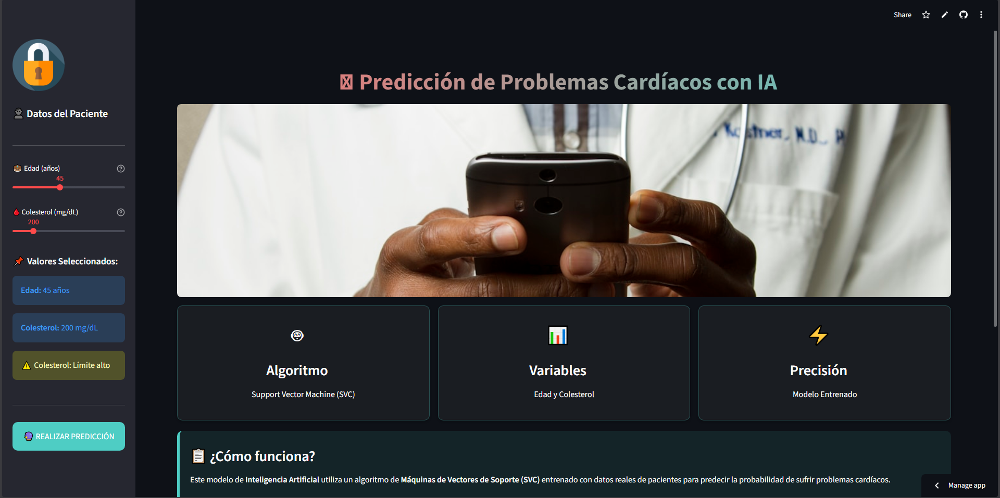

# 🫀 Predicción de Problemas Cardíacos con IA

<div align="center">


[](https://cardiacoappjfgg.streamlit.app/)
[](https://www.python.org/downloads/)
[](https://opensource.org/licenses/MIT)

**Aplicación web de Machine Learning para predecir riesgos cardíacos basada en edad y colesterol**

[Demo en Vivo](https://cardiacoappjfgg.streamlit.app/) • [Reportar Bug](https://github.com/JuanFelipeGomezGarcia/Cardiaco_Streamlit/issues) • [Solicitar Feature](https://github.com/JuanFelipeGomezGarcia/Cardiaco_Streamlit/issues)

</div>

---

## 📋 Tabla de Contenidos

- [Descripción](#-descripción)
- [Características](#-características)
- [Demo](#-demo)
- [Tecnologías](#-tecnologías)
- [Instalación](#-instalación)
- [Uso](#-uso)
- [Modelo de Machine Learning](#-modelo-de-machine-learning)
- [Estructura del Proyecto](#-estructura-del-proyecto)
- [Autor](#-autor)

---

## 🎯 Descripción

Esta aplicación utiliza **Inteligencia Artificial** para predecir la probabilidad de que un paciente sufra problemas cardíacos basándose en dos factores clave:

- 🎂 **Edad** (20-80 años)
- 🩸 **Nivel de Colesterol** (120-600 mg/dL)

El modelo fue entrenado utilizando **Support Vector Machine (SVC)** de scikit-learn con datos reales de pacientes, logrando identificar patrones que permiten clasificar el riesgo cardíaco.

> ⚠️ **Nota Importante:** Esta es una herramienta educativa y **NO reemplaza** el diagnóstico médico profesional.

---

## ✨ Características

### 🎨 Interfaz de Usuario
- ✅ Diseño moderno y responsivo
- 🌓 Soporte para modo claro y oscuro
- 📱 Compatible con dispositivos móviles
- 🎭 Animaciones y efectos visuales

### 📊 Visualizaciones
- 📈 Gráfico de medidor (gauge) de riesgo
- 🎨 Indicadores visuales de colesterol
- 📉 Interpretación automática de resultados

### 🤖 Machine Learning
- 🧠 Modelo SVC entrenado
- ⚡ Predicción en tiempo real
- 📊 Escalado de datos con MinMaxScaler
- 💾 Modelos pre-entrenados incluidos

### 🔧 Funcionalidades
- 🎚️ Sliders interactivos para entrada de datos
- 📋 Recomendaciones personalizadas según resultado
- 🎈 Animaciones para resultados positivos
- 📱 Interfaz intuitiva y fácil de usar

---

## 🎬 Demo

### Captura de Pantalla



### Prueba la App en Vivo

🔗 **[Abrir Aplicación](https://cardiacoappjfgg.streamlit.app/)**

---

## 🛠️ Tecnologías

### Backend
- 
- 
- 
- 

### Frontend
- 
- 
- 
- 

### Deployment
- 
- 

---

## 📥 Instalación

### Prerrequisitos

- Python 3.10 (exactamente)
- pip (gestor de paquetes de Python)
- Git

### Pasos de Instalación

1. **Clonar el repositorio**
```bash
git clone https://github.com/JuanFelipeGomezGarcia/Cardiaco_Streamlit.git
cd Cardiaco_Streamlit
```

2. **Crear ambiente virtual (opcional pero recomendado)**
```bash
python -m venv venv

# Windows
venv\Scripts\activate

# Linux/Mac
source venv/bin/activate
```

3. **Instalar dependencias**
```bash
pip install -r requirements.txt
```

4. **Ejecutar la aplicación**
```bash
streamlit run app.py
```

5. **Abrir en el navegador**
```
La app se abrirá automáticamente en: http://localhost:8501
```

---

## 🚀 Uso

### Paso 1: Ingresar Datos del Paciente
En la barra lateral izquierda, ajusta los valores:
- 🎂 **Edad**: Usa el slider para seleccionar entre 20-80 años
- 🩸 **Colesterol**: Ajusta el nivel entre 120-600 mg/dL

### Paso 2: Realizar Predicción
Haz clic en el botón **"🔮 REALIZAR PREDICCIÓN"**

### Paso 3: Interpretar Resultados
La aplicación mostrará:
- 📊 Gráfico de medidor de riesgo
- ✅ o ⚠️ Clasificación de riesgo (Bajo/Alto)
- 📋 Recomendaciones personalizadas
- 🖼️ Visualización del resultado

---

## 🧠 Modelo de Machine Learning

### Algoritmo
**Support Vector Machine (SVC)** - Clasificador de vectores de soporte

### Características del Modelo
- **Entrada**: 2 variables (edad, colesterol)
- **Salida**: Clasificación binaria (0: Sin riesgo, 1: Con riesgo)
- **Preprocesamiento**: MinMaxScaler para normalización
- **Framework**: scikit-learn

### Pipeline de Entrenamiento
```python
1. Carga de datos de pacientes
2. Preprocesamiento con MinMaxScaler
3. Entrenamiento del modelo SVC
4. Validación y evaluación
5. Exportación con joblib
```

### Archivos del Modelo
- `svc_model.jb` - Modelo SVC entrenado
- `scaler.jb` - Escalador MinMaxScaler ajustado

---

## 📁 Estructura del Proyecto

```
Cardiaco_Streamlit/
│
├── app.py                  # Aplicación principal de Streamlit
├── svc_model.jb           # Modelo SVC entrenado
├── scaler.jb              # Escalador MinMaxScaler
├── requirements.txt       # Dependencias del proyecto
├── README.md             # Este archivo
├── .gitignore            # Archivos ignorados por Git
│
└── assets/               # (Opcional) Recursos adicionales
    └── images/
```

---


## 👨‍💻 Autor

**Juan Felipe Gómez García**

- 🎓 Universidad Autónoma de Bucaramanga (UNAB)
- 📧 Email: [juanfelipe.gomezgarcia@gmail.com](mailto:juanfelipe.gomezgarcia@gmail.com)
- 🐙 GitHub: [@JuanFelipeGomezGarcia](https://github.com/JuanFelipeGomezGarcia)

---


## 🙏 Agradecimientos

- 🏥 Datos de entrenamiento basados en registros médicos públicos
- 🎨 Iconos de [Flaticon](https://www.flaticon.com/)
- 📸 Imágenes de [Unsplash](https://unsplash.com/)
- 🚀 Deployment con [Streamlit Cloud](https://streamlit.io/cloud)
- 📚 Documentación de [Scikit-learn](https://scikit-learn.org/)

---

## 📊 Estadísticas del Proyecto


---

<div align="center">

**⭐ Si te gustó este proyecto, dale una estrella en GitHub ⭐**

Hecho con ❤️ y ☕ por Juan Felipe Gómez

© 2025 UNAB

</div>
